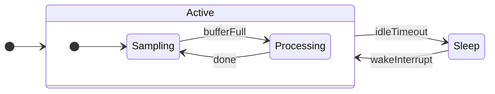

# NinjaHSM

[](https://github.com/gbmhunter/NinjaHSM/actions/workflows/cmake-single-platform.yml)


NinjaHSM is a small, simple **hierarchical state machine** (HSM) library written in C++ and designed for embedded systems. It is header-only, performs **no dynamic memory allocation**, and has a single dependency ([ETL](https://www.etlcpp.com/)).



*Example: a low-power sensor node. While `Active` it alternates between `Sampling` and `Processing`; on an idle timeout it drops to `Sleep`, and a wake interrupt brings it back. `Sampling` and `Processing` are child states of `Active`, so any event they don't handle bubbles up to `Active`.*

## Features

### General

* Easy installation if you use CMake via `FetchContent`.
* Minimal dependencies: C++17 and ETL (Embedded Template Library).
* No dynamic memory allocation (callbacks use ETL delegates, not `std::function`).
* `makeState()` helper to declare states without delegate boilerplate.
* Optional observer hooks for transitions, unhandled events, and errors (great for logging/tracing).
* Suitable for embedded systems.

### State Features

* Hierarchical state are supported by providing the parent state when creating a child state.
* Each state can have an `entry()`, `event()` and `exit()` method.
* The `event()` method takes a user defined `Event` object as a parameter.
* Events bubble up to parent states if the child state does not handle the event.
* Events stop bubbling up if a child state calls `transitionTo()` or `eventHandled()`.
* `transitionTo()` may be called from within `entry()`/`exit()` methods (e.g. for entry guards).

## How does it compare?

There are several good C++ state machine libraries; which one fits depends on your constraints. This table is a best-effort summary to help you decide --- corrections via issues/PRs are welcome.

| | **NinjaHSM** | [tinyfsm](https://github.com/digint/tinyfsm) | [Boost.SML](https://github.com/boost-ext/sml) | [QP/C++](https://github.com/QuantumLeaps/qpcpp) |
|---|---|---|---|---|
| Hierarchical states | ✅ | ❌ (flat FSM) | ✅ (composite) | ✅ |
| No dynamic allocation | ✅ | ✅ | ✅ | ✅ |
| Header-only | ✅ | ✅ | ✅ | ❌ (framework) |
| Dependencies | ETL | none | none | none (full framework) |
| Event bubbling to parents | ✅ | n/a | ✅ | ✅ |
| Transition / error observers | ✅ | ❌ | logging hooks | ✅ |
| License | MIT | MIT | Boost | GPL / commercial |
| Focus | Small, simple embedded HSM | Minimal flat FSM | Compile-time DSL | Full RTOS framework |

NinjaHSM's niche: a true hierarchical state machine that stays small and readable, allocates nothing, and reads like ordinary C++ (no heavy template DSL) --- while leaning on ETL so it drops cleanly into existing embedded projects.

## Installation

### CMake (FetchContent)

If you are using CMake, you can add NinjaHSM to your project by using `FetchContent` in your `CMakeLists.txt` file like so:

```cmake
include(FetchContent)
FetchContent_Declare(NinjaHSM
    GIT_REPOSITORY https://github.com/gbmhunter/NinjaHSM.git
    GIT_TAG v1.4.0 # This can be a hash, tag or branch.
)
FetchContent_MakeAvailable(NinjaHSM)

# Then later once you've defined your target. Linking against the NinjaHSM target also
# propagates its include directory and its ETL dependency, so nothing else is needed.
target_link_libraries(your_app PRIVATE NinjaHSM)
```

If you want to see `FetchContent` in action, see the `examples/basic_example/` CMake project.

### PlatformIO

Add NinjaHSM to your project's `platformio.ini`. Its dependency on ETL is resolved automatically.

```ini
lib_deps =
    https://github.com/gbmhunter/NinjaHSM.git#v1.4.0
```

### Arduino

The library follows the Arduino library layout (headers under `src/`), so you can install it by cloning (or downloading a release ZIP into `Sketch > Include Library > Add .ZIP Library...`) into your `libraries/` folder. You will also need to install the **Embedded Template Library (ETL)** dependency via the Library Manager.

### Conan

NinjaHSM ships a [Conan](https://conan.io/) recipe. Add it to your `conanfile.txt`:

```ini
[requires]
ninjahsm/1.4.0
```

or your `conanfile.py`:

```python
def requirements(self):
    self.requires("ninjahsm/1.4.0")
```

Its dependency on ETL is pulled in transitively. In your `CMakeLists.txt`, link the generated target (which also exposes the ETL headers):

```cmake
find_package(ninjahsm CONFIG REQUIRED)
target_link_libraries(your_app PRIVATE ninjahsm::ninjahsm)
```

If NinjaHSM is not yet on a Conan remote you use, you can export the recipe locally from a clone with `conan create .`.

### Including the header

However you installed it, include the umbrella header and you're ready to go (see the Usage section below):

```cpp
#include <NinjaHSM/NinjaHSM.hpp>
```

## Usage

Firstly, include the NinjaHSM header in your source files. It's also a good idea to use the `using namespace NinjaHSM;` directive to make the code less verbose.

```cpp
#include "NinjaHSM/NinjaHSM.hpp"

using namespace NinjaHSM;
```

### Defining Events

You will need to define an `Event` class. This will be used to pass events to the `onEvent()` method, so your state machine can react to things. But you will normally want to define more than one event type. The best way to create a generic "typesafe union" of all the events using `std::variant` as shown below.

```cpp
/**
 * Wrap all the events in a namespace for ease of use.
 */
namespace Events {

/**
 * Events don't have to have any data associated with them, like this one!
 */
struct TimerExpired {};

/**
 * This event has some data associated with it.
 */
struct ButtonPressed {
    uint32_t buttonId;
};

/**
 * This is like a typesafe "union" of all the events.
 */
using Generic = std::variant<TimerExpired, ButtonPressed>;

}
```

## Creating A State Machine

Now we have our events defined, we can create a state machine. You create your own state machine class that uses composition with a `NinjaHSM::StateMachine` object. This approach provides better encapsulation and flexibility compared to inheritance, while the `NinjaHSM::StateMachine` class provides all the boilerplate code for you, including the transition logic. However, you can also inherit from `NinjaHSM::StateMachine` instead if you prefer.

In your class, you will need to create a `NinjaHSM::State` object for each state. These are initilized in the constructor, and take in a human readable name, `entry()`, `event()`, `exit()` functions, and a pointer to the parent state (`nullptr` if it has no parent). Use the pointer to the parent state to create a hierarchical state machine (HSM).

The following example creates a basic hierarchical state machine with three states, one of which is a child state. The hierarchy looks like this:

```text
State1
   |-- State1a
State2
```

ETL delegates are used to provide class methods as callbacks with guaranteed no dynamic memory allocation (as opposed to `std::function` with `std::bind` or lambdas), making it ideal for embedded systems. The `makeState()` helper builds each `State` from your handler methods without you having to spell out the three `::create<>` delegate expressions by hand --- you name the event type once, and each handler method exactly once (so IDE "go to definition" and grep still work, unlike a macro). Here is the C++ code:

```cpp
#include <NinjaHSM/NinjaHSM.hpp>

class MyStateMachine {
public:
    MyStateMachine() :
    m_state1(makeState<Events::Generic,
        &MyStateMachine::state1_entry,
        &MyStateMachine::state1_event,
        &MyStateMachine::state1_exit>("State1", *this)),
    m_state1a(makeState<Events::Generic,
        &MyStateMachine::state1a_entry,
        &MyStateMachine::state1a_event,
        &MyStateMachine::state1a_exit>("State1a", *this, &m_state1)), // NOTE: &m_state1 makes State1a a child of State1
    m_state2(makeState<Events::Generic,
        &MyStateMachine::state2_entry,
        &MyStateMachine::state2_event,
        &MyStateMachine::state2_exit>("State2", *this)),
    m_stateMachine() {
        m_stateMachine.initialTransitionTo(m_state1);
    }

    // Public interface methods
    void handleEvent(const Events::Generic& event) {
        m_stateMachine.handleEvent(event);
    }

    const State<Events::Generic>* getCurrentState() {
        return m_stateMachine.getCurrentState();
    }

private:
    //============================================================================================//
    // state1
    //============================================================================================//

    void state1_entry() {}
    void state1_event(Events::Generic const & event) {
        if (std::holds_alternative<Events::TimerExpired>(event)) {
            // Let's go to a different state!
            m_stateMachine.transitionTo(m_state1a);
        }
        else if (std::holds_alternative<Events::ButtonPressed>(event)) {
            // We know which event we got, so we can safely access the union member
            Events::ButtonPressed const & buttonPressed = std::get<Events::ButtonPressed>(event);
            printf("Got event with data: %d\n", buttonPressed.buttonId);
            m_stateMachine.eventHandled(); // Prevents event from bubbling up to parent states
        }
    }
    void state1_exit() {}

    //============================================================================================//
    // state1/state1a
    //============================================================================================//

    void state1a_entry() {}
    void state1a_event(Events::Generic const & event) {}
    void state1a_exit() {}

    //============================================================================================//
    // state2
    //============================================================================================//

    void state2_entry() {}
    void state2_event(Events::Generic const & event) {}
    void state2_exit() {}

    //============================================================================================//
    // State variables
    //============================================================================================//

    State<Events::Generic> m_state1;
    State<Events::Generic> m_state1a;
    State<Events::Generic> m_state2;

    // State machine instance
    StateMachine<Events::Generic> m_stateMachine;
};
```

`makeState()` takes the event type and the three handler member-function pointers as template arguments, followed by `(name, instance, parent)`. The `parent` argument defaults to `nullptr`, so top-level states can omit it. The owning class type is deduced from the `instance` argument.

All three handler slots are mandatory, but any of them may be `nullptr` if the state does not need that handler --- this saves you writing empty stub methods. The slot is positional, so you always pass three arguments. For example, a leaf state that only reacts to events:

```c++
m_state1(makeState<Events::Generic,
    nullptr,                          // no entry()
    &MyStateMachine::state1_event,
    nullptr>("State1", *this))        // no exit()
```

A `nullptr` handler is left unbound and is skipped at runtime. In particular, a state with no `event()` handler simply lets every event bubble up to its parent.

If you prefer, you can still construct `State` objects directly with the underlying delegates (`State<Events::Generic>::EntryDelegate::create<MyStateMachine, &MyStateMachine::state1_entry>(*this)`, etc.) --- `makeState()` is simply a thin wrapper around that.

Notice how in the `state1_event()` method, we listen to some events and take actions (like transitioning to a different state, or handling data passed in with the event). Also notice how we call methods on the `m_stateMachine` member to interact with the state machine.

The public interface methods we created delegate to the internal `StateMachine` object:

* `handleEvent(const Event& event)`: Pass an event to the state machine. The state machine will call then current state's `onEvent()` function. This is designed to be called from outside your state machine, and is how you pass events (and data) to the state machine. We use this in our `main()` function below.
* `getCurrentState()`: Gets the current state. May be `nullptr` if the state machine has not been initialized yet.

Within state methods, you call methods directly on the `m_stateMachine` member:

* `m_stateMachine.initialTransitionTo(State& state)`: Perform an initial transition to the provided state. Designed to be called from the constructor of your state machine class. We used that above in the constructor of `MyStateMachine`.
* `m_stateMachine.transitionTo(State& state)`: Call this to transition to the provided state. This is designed to be called from within a state's `onEvent()` method (or in rarer cases, from within a state's `entry()` or `exit()` methods --- see below for more details). The transition is NOT queued, it happens immediately. When `transitionTo()` returns, the transition has completed.
* `m_stateMachine.eventHandled()`: Call this from within a state's `onEvent()` method when you have handled an event. This prevents the event from bubbling up to parent states. You do not need to call this if you transition to a different state, as the transition will automatically stop event bubbling.

Now we can create an instance of our state machine and start sending events to it:

```cpp
int main() {
    printf("basic_example running...\n");
    // Create the state machine
    MyStateMachine stateMachine;
    printf("State machine created. state is: %s\n", stateMachine.getCurrentState()->name);

    // Send an event with no data, this causes a change in state (see the state1_event() method).
    Events::TimerExpired event1;
    stateMachine.handleEvent(event1);
    printf("Event 1 handled. state is now: %s\n", stateMachine.getCurrentState()->name);

    // Send an event with data, this doesn't change the state, but just shows how you can
    // react to data passed in with the event.
    Events::ButtonPressed event2;
    event2.buttonId = 123;
    stateMachine.handleEvent(event2);
    printf("Event 2 handled. state is now: %s\n", stateMachine.getCurrentState()->name);
    
    return 0;
}
```

This prints:

```text
basic_example running...
State machine created. state is: State1
Event 1 handled. state is now: State1a
Got event with data: 123
Event 2 handled. state is now: State1a
```

This example is available in the `examples/basic_example/` directory.

### Entry and Exit Guards

NinjaHSM supports the ability to call `transitionTo()` from within a state's `entry()` or `exit()` methods. One use case for this is to add entry guards to states, protecting them from being entered if certain conditions are not met. When a state can be transitions to from many other states, it is less code repetition to add the guard to the entry function of the destination state rather than in every source state. An example would be a rocket's LAUNCH state. You could add guards to LAUNCH's `entry()` method to ensure the rocket has no issues before it can be launched, and if it does, transition to an ERROR state instead.

```cpp
void stateRunning_entry() {
    // Example of an entry guard.
    if (notReady) {
        transitionTo(stateIdle);
        return;
    }
    // Do normal entry logic here.
}
```

Because `entry()` and `exit()` states are only every called by `transitionTo()` in the first place, calling `transitionTo()` from within `entry()` or `exit()` is recursive. NinjaHSM supports this, with the following rules:

**entry() Rules:**

* If `stateA` calls `transitionTo(stateB)` from within it's `entry()` method, AND `stateB` IS NOT a child of `stateA`, then NinjaHSM asummes `stateA` was not entered, and does not call `stateA`'s `exit()` method.
* If `stateA` calls `transitionTo(stateB)` from within it's `entry()` method, AND `stateB` IS a child of `stateA`, then NinjaHSM asummes `stateA` was entered succesfully, and does not call `stateA`'s `exit()` method or recall `stateA`'s `entry()` method.

**exit() Rules:**

* If `stateA` calls `transitionTo(stateB)` from within it's `exit()` method, AND `stateB` IS NOT a child of `stateA`, then NinjaHSM asummes `stateA` was exited succesfully, and does not call `stateA`'s `exit()` method again.
* If `stateA` calls `transitionTo(stateB)` from within it's `exit()` method, AND `stateB` IS a child of `stateA`, then NinjaHSM asummes `stateA` was not exited, and does not call `stateA`'s `entry()` method again.

Hopefully these rules make intuitive sense! There is also a max. recursion depth of 50 (set by `MAX_RECURSION_COUNT` in `StateMachine.hpp`) to prevent infinite recursion in the case of bugs (e.g. if you unconditionally call `transitionTo(stateB)` in `stateA`'s `entry()` method, and unconditionally call `transitionTo(stateA)` in `stateB`'s `entry()` method). When this limit is hit the transition is abandoned; you can be notified of it via the error observer (see below).

When the limit is hit, the current state is left indeterminate (the transition was abandoned partway). To recover, transition to a known-good state once control returns to your code --- for example from the error observer, or after `handleEvent()` returns. The internal recursion counter is reset automatically once the outermost `transitionTo()` unwinds, so the recovery transition starts cleanly.

### Threading and re-entrancy

`handleEvent()` and `transitionTo()` are **not re-entrant** --- they share internal bookkeeping, so you must not start a new call before the current one returns. In practice this means a single state machine instance should be driven from one context only; do not call `handleEvent()` from one thread (or from an interrupt) while another `handleEvent()`/`transitionTo()` is still in progress. To feed events in from an interrupt, push them onto a queue from the ISR and drain that queue from your main loop. Calling `transitionTo()` or `eventHandled()` from within a state's own `event()`/`entry()`/`exit()` handler is fine --- that is the normal usage and is not re-entrancy.

### Observers (Logging, Tracing and Error Handling)

It is often useful to know what the state machine is doing without having to instrument every single `entry()`/`exit()`/`event()` method by hand. NinjaHSM provides three optional observer hooks on the `StateMachine` object. All of them are ETL delegates (no dynamic allocation), are unset by default, and have zero cost beyond a single `is_valid()` check when not set.

* **Transition observer** --- called immediately after any state's `entry()` or `exit()` method runs. Ideal for logging/tracing every transition in one place.
* **Unhandled event observer** --- called when an event bubbles past the top of the hierarchy without any state calling `transitionTo()` or `eventHandled()`. Useful for catching events you forgot to handle.
* **Error observer** --- called when the state machine hits an internal error, such as `transitionTo()` recursing deeper than `MAX_RECURSION_COUNT` (which otherwise fails silently).

```cpp
// Set these up once, e.g. in your state machine class's constructor.
m_stateMachine.setTransitionObserver(
    StateMachine<Events::Generic>::TransitionObserver::create<MyStateMachine, &MyStateMachine::onTransition>(*this));
m_stateMachine.setUnhandledEventObserver(
    StateMachine<Events::Generic>::UnhandledEventObserver::create<MyStateMachine, &MyStateMachine::onUnhandledEvent>(*this));
m_stateMachine.setErrorObserver(
    StateMachine<Events::Generic>::ErrorObserver::create<MyStateMachine, &MyStateMachine::onError>(*this));

// ...

void onTransition(const State<Events::Generic>& state, TransitionAction action) {
    printf("%s %s\n", action == TransitionAction::Entry ? "Entered" : "Exited", state.name);
}

void onUnhandledEvent(const Events::Generic& event) {
    printf("Event was not handled by any state.\n");
}

void onError(Error error) {
    // error == Error::MaxRecursionDepthExceeded
    printf("State machine error!\n");
}
```

Pass a default constructed (unbound) delegate to any of the setters to remove a previously set observer.

### Others

See the `examples/` and `test/` directories for more examples on how to use NinjaHSM.

## Building the Test Suite

This project defines a CMake option `NINJAHSM_BUILD_TESTS` (which defaults to off) to allow the user to control whether the test suite is built. This defaults to off because if embedded projects use this as a library, they will likely encounter build errors if they try and pull in GoogleTest and/or build the test application.

To build the test suite, you can use the following CMake command:

```bash
cmake -DNINJAHSM_BUILD_TESTS=ON ..
```

Alternatively, if you are including NinjaHSM using `FetchContent`, you can set the option in your `CMakeLists.txt` file like so:

```cmake
include(FetchContent)
set(NINJAHSM_BUILD_TESTS ON CACHE BOOL "" FORCE)
FetchContent_Declare(NinjaHSM
    GIT_REPOSITORY https://github.com/gbmhunter/NinjaHSM.git
    GIT_TAG v1.4.0 # This can be a hash, tag or branch.
)
FetchContent_MakeAvailable(NinjaHSM)
target_link_libraries(your_app NinjaHSM)
```
